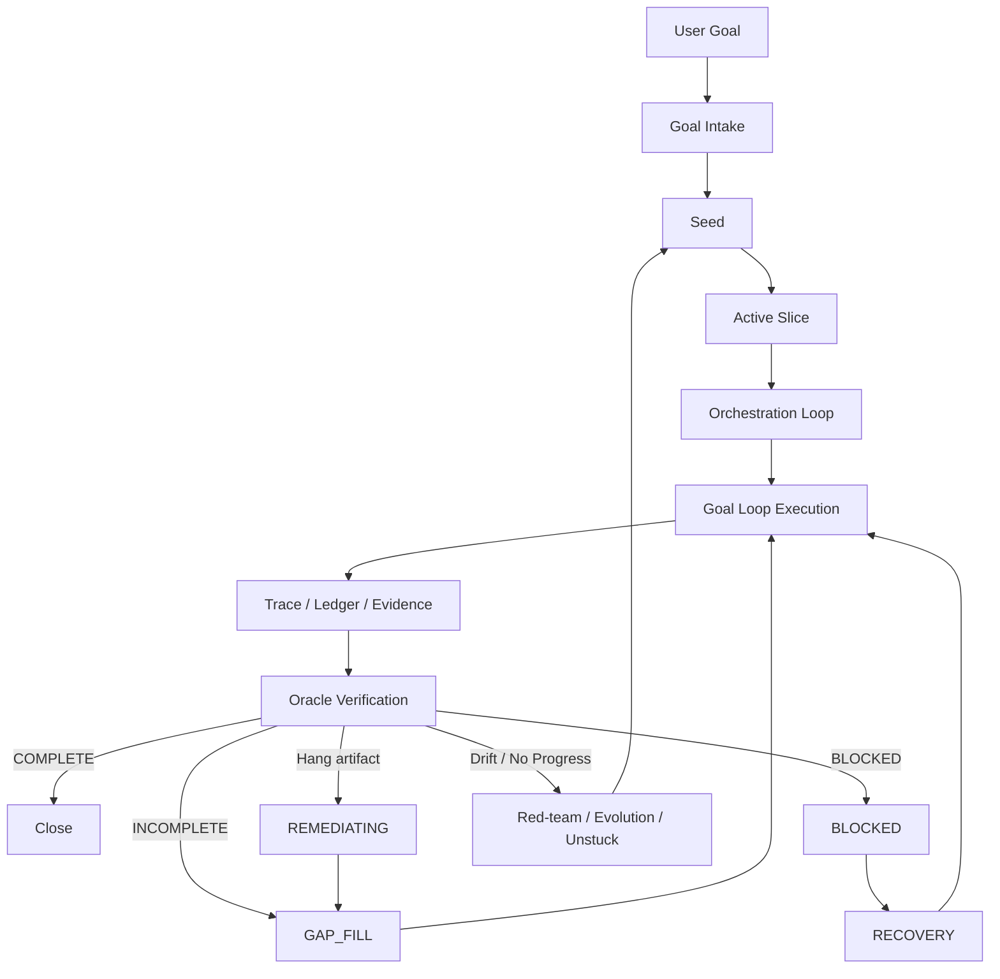

# Signature Harness (SH)

개인용 goal-loop 하네스입니다. Codex와 Claude Code에서 같은 작업 철학을 쓰기 위해 만든 portable skill/runtime bundle이며, 핵심 목적은 하나입니다.

```text
목표를 Seed로 고정하고, Active Slice로 좁히고, 실행 증거를 남긴 뒤, Oracle 검증을 통과할 때만 완료한다.
```

SH는 범용 비서를 하나 더 만드는 프로젝트가 아닙니다. 현재 1차 vertical은 **AI coding-agent completion auditor**입니다. 에이전트가 “끝났다”고 말하는 순간을 그대로 믿지 않고, state transition, trace, artifact, eval, evidence gate로 검수합니다.

## 현재 상태

| 항목 | 상태 |
| --- | --- |
| Codex/Claude용 portable skills | 구현됨 |
| `/sh`, `$sh-goal` entrypoint | 구현됨 |
| deterministic runtime substrate | 구현됨 |
| run manifest / state / trace / replay / ledger | 구현됨 |
| artifact-backed evidence gate | 구현됨 |
| benchmark / regression eval suite | 구현됨 |
| permission policy / approval artifact | 구현됨 |
| Completion Auditor hang/remediation gate | 구현됨 |
| plugin manifest identity guard | 구현됨 |
| real sandbox adapter for unsafe resume | 아직 미구현, fail-closed |
| full host-level Claude/Codex E2E orchestration proof | 아직 claim하지 않음 |

이 저장소는 다른 머신에서 `git pull` 후 바로 설치해서 쓰는 것을 우선합니다. 포트폴리오용 긴 검수 문서, HTML 산출물, 로컬 run artifact는 원격 저장소에 포함하지 않습니다.

## 빠른 시작

Windows PowerShell 기준:

```powershell
git clone https://github.com/FrogRim/signature-harness.git
cd signature-harness
.\scripts\install_local.ps1 -DryRun
.\scripts\install_local.ps1
```

덮어쓰기 충돌이 있을 때만:

```powershell
.\scripts\install_local.ps1 -Force
```

`-Force`는 기존 unmanaged 디렉토리를 삭제하지 않고 `.sh-backup-<timestamp>`로 백업한 뒤 설치합니다.

## 공개 사용면

평소에 기억할 명령은 최소화합니다.

| 환경 | 명령 |
| --- | --- |
| Claude Code | `/sh <goal>` |
| Claude Code namespaced | `/signature-harness:sh <goal>` |
| Codex / portable skill | `$sh-goal <goal>` |

skill은 세 tier로 나뉩니다.

1. **Public entrypoint** - `/sh`, `/signature-harness:sh`, `$sh-goal`. 일반 사용자는 이 entrypoint만 기억하면 됩니다.
2. **Direct utility skill** - `deep-interview`, `brainstorming`, `test-driven-development`, `meta-harness-audit`. 좁은 trigger에 맞을 때만 명시적으로 호출하는 보조 도구입니다.
3. **Routed internal module** - `orchestration-loop`, `oracle-verification`, `red-team`, `active-slice`, `seed-crystallizer` 등. 직접 부르기보다 `/sh` 또는 `$sh-goal`의 routing에 맡기는 것이 기본입니다.

선로는 좁게 두고, 보조 공구는 필요할 때 직접 꺼낼 수 있게 한 구조입니다.

## 핵심 흐름



핵심 역할:

- `orchestration-loop`는 관제센터입니다. 직접 구현하거나 파일을 수정하지 않고, route/directive만 만듭니다.
- `goal-loop`는 실제 전차입니다. Active Slice 범위 안에서 실행하고 증거를 남깁니다.
- `oracle-verification`을 통과하지 않으면 완료가 아닙니다.
- `INCOMPLETE`는 runtime state가 아니라 verdict입니다. 보통 `GAP_FILL`로 좁혀 누락 증거만 채웁니다.
- 외부 runner hang artifact는 예외적으로 `REMEDIATING`으로 들어간 뒤 cleanup/reset evidence를 요구합니다.

## SH식 SDD

SH에서 Spec Driven Development는 거대한 사전 명세 문서를 강제하는 방식이 아닙니다. 모델을 경직시키지 않기 위해 strict schema는 실패 비용이 큰 경계에만 둡니다.

| 개념 | SH에서의 역할 |
| --- | --- |
| Goal | 사용자의 최종 목적 |
| Seed | 실행 전에 고정하는 최소 계약 |
| Active Slice | 지금 실행할 수 있을 만큼 좁힌 작업 범위 |
| Evidence Map | Oracle이 완료 판정에 사용할 증거 목록 |
| Oracle Verdict | `COMPLETE`, `INCOMPLETE`, `BLOCKED`, drift/no-progress 판정 |
| Gap-fill Directive | 누락 증거만 확보하도록 축소한 재배차 명령 |

즉 SH의 SDD는 “모든 생각을 schema로 묶기”가 아니라 “목표, 범위, 완료 증거, 복구 경로만 기계적으로 고정하기”입니다. LLM의 탐색 능력은 살리고, 탈선하기 쉬운 경계만 철길로 고정합니다.

## Thin Contract Patch

세 가지 실행 문구는 SH에서 얇은 계약으로만 번역합니다.

- `acceptance_criteria`는 Seed 수락 시점에 사전 동결합니다. 각 criterion은 증명할 claim, 필요한 evidence, pass/fail 조건을 가져야 합니다.
- `verification_tier`는 evidence depth만 정합니다. 모델의 사고, 설계, 구현 순서를 묶지 않습니다.
- parallel fan-out은 기본적으로 금지합니다. 독립 lane, 비교 가능한 evidence, synthesis owner, cost gate가 모두 있을 때만 `parallel-hypothesis`를 씁니다.
- 완벽주의 표현, 불안정한 중간 저장 강제, 모든 단계의 무조건적 전면 검증 요구, 무제한 agent fan-out은 SH contract로 쓰지 않습니다.

완료는 “강한 표현”이 아니라 다음 조건으로 판단합니다.

```text
frozen acceptance criteria all mapped to evidence
+ required verification tier evidence present
+ oracle-verification COMPLETE
+ no unresolved red-team BLOCK
+ residual risk explicit
```

## Runtime Substrate

주요 runtime 파일:

| 경로 | 역할 |
| --- | --- |
| `scripts/sh_runtime.py` | CLI runtime, validators, eval runner, trace/replay writer |
| `scripts/sh_runtime_core.py` | 상태 머신, transition map, 공통 invariant |
| `schemas/tool_contracts.json` | tool/subcommand contract |
| `schemas/failure_taxonomy.json` | 구조화된 failure code |
| `schemas/completion_artifact.schema.json` | Completion Auditor artifact contract |
| `evals/benchmark_tasks.jsonl` | benchmark suite |
| `evals/regression_tasks.jsonl` | regression suite |
| `security/policy.json` | permission/network/filesystem policy |

실행 중 생성되는 상태는 `.sh/` 아래에 생기며, `.gitignore` 대상입니다.

```text
.sh/runs/<run_id>/run_manifest.json
.sh/runs/<run_id>/state.json
.sh/runs/<run_id>/trace.jsonl
.sh/runs/<run_id>/tool_calls.jsonl
.sh/runs/<run_id>/step_ledger.jsonl
.sh/runs/<run_id>/replay.json
.sh/evals/<eval_run_id>/eval_result.json
.sh/evals/<eval_run_id>/scorecard.json
```

## 상태 머신

Core runtime state:

| 분류 | 상태 |
| --- | --- |
| Execution | `RUNNING`, `GAP_FILL`, `RECOVERY`, `REMEDIATING` |
| Suspended | `PAUSED`, `BLOCKED` |
| Terminal | `COMPLETE`, `ABORTED` |

주요 전이:

| From | Event | To | 의미 |
| --- | --- | --- | --- |
| `RUNNING` | `oracle_complete` | `COMPLETE` | 모든 evidence 통과 |
| `RUNNING` | `oracle_incomplete` | `GAP_FILL` | 누락 증거만 좁혀 재실행 |
| `RUNNING` | `oracle_blocked` | `BLOCKED` | 사용자/외부 권한 필요 |
| `RUNNING` | `redteam_no_progress` | `PAUSED` | 반복 실패 또는 no-progress |
| `RUNNING` | `heartbeat_timeout` | `ABORTED` | hard stop 후보 |
| `RUNNING/GAP_FILL/RECOVERY` | `sut_hang_incomplete` | `REMEDIATING` | 외부 runner hang artifact 검출 |
| `REMEDIATING` | `cleanup_evidence_valid` | `GAP_FILL` | cleanup/reset 증거 통과, time debt 정리 |
| `REMEDIATING` | `cleanup_evidence_invalid` | `REMEDIATING` | deadline 전까지 remediation 유지 |
| `REMEDIATING` | `cleanup_timeout` | `ABORTED` | 환경 제어력 상실 |
| `GAP_FILL` | `missing_proof_acquired` | `RUNNING` | 누락 증거 확보 후 정상 실행 복귀 |

명시되지 않은 transition은 system-level exception으로 취급합니다.

## Completion Auditor Hang Gate

외부 runner가 아래처럼 self-contained artifact를 넘기면 SH가 감사합니다.

```json
{
  "kind": "sut_tick_hang",
  "process_id": "proc_123",
  "tick_id": "tick_45",
  "started_at": "2026-06-13T18:10:00Z",
  "observed_at": "2026-06-13T18:11:00Z",
  "duration_ms": 60000,
  "previous_artifact_hash": "sha256:...",
  "current_artifact_hash": "sha256:...",
  "retry_count": 0
}
```

검증:

```powershell
py scripts\sh_runtime.py validate-completion-artifact --artifact evals\fixtures\evidence\sut_hang_timeout.json
```

판정:

- timeout이고 hash가 그대로면 `INCOMPLETE` + `REMEDIATING`
- timeout이어도 hash가 바뀌었으면 `RUNNING`
- cleanup/reset evidence가 유효하면 `GAP_FILL`
- cleanup/reset evidence deadline이 지나면 `ABORTED`

SH는 여기서도 process를 직접 kill하지 않습니다. 외부 runner가 cleanup/reset을 수행하고, SH는 그 evidence만 검수합니다.

## Security Boundary

기본 원칙:

- resume command string을 실행하지 않습니다.
- `run-resume`은 real sandbox adapter가 없으면 fail-closed입니다.
- user secret은 command string에 포매팅하지 않고 env-only로 주입해야 합니다.
- shell metacharacter가 있는 resume contract는 security incident로 거부합니다.
- filesystem/network/shell intent는 `security/policy.json`으로 검사합니다.

정책 smoke:

```powershell
py scripts\sh_runtime.py validate-policy --root . --policy security\policy.json --action-file security\fixtures\read_only_ok.json
py scripts\sh_runtime.py validate-policy --root . --policy security\policy.json --action-file security\fixtures\dangerous_shell_needs_approval.json
```

두 번째 명령은 approval이 필요한 위험 action fixture라 exit `7`로 막히는 것이 정상입니다.

## Plugin Manifest Policy

SH는 Claude/Codex host에서 skill harness로 쓰는 것이 기본이고, desktop marketplace UI를 1차 product surface로 보지 않습니다.

| 파일 | 역할 |
| --- | --- |
| `.claude-plugin/plugin.json` | Claude plugin identity metadata |
| `.codex-plugin/plugin.json` | Codex plugin identity metadata |
| `.claude-plugin/marketplace.json` | Claude marketplace/source metadata |
| `.codex-plugin/marketplace.json` | Codex marketplace/source metadata and listing interface |

정책:

- plugin manifest에는 `name`, `version`, `description`, `author`, repository 같은 identity/publisher metadata만 둡니다.
- Codex skill discovery는 repo root의 `skills/` auto-discovery로 검증했습니다.
- `.codex-plugin/plugin.json`에는 redundant `"skills": "./skills/"`와 UI용 `interface`를 두지 않습니다.
- Codex listing UI metadata는 `.codex-plugin/marketplace.json`에 둡니다.
- `validate-schemas`는 존재하는 manifest들의 `name/version` 일치만 강제합니다. host-specific presentation field는 drift guard 대상이 아닙니다.

## 검증

pull 후 최소 검증:

```powershell
py -m py_compile scripts\sh_runtime.py scripts\sh_runtime_core.py
py scripts\sh_runtime.py self-test
py scripts\sh_runtime.py validate-schemas --root .
py scripts\sh_runtime.py validate-release --root .
git diff --check
```

eval까지 확인:

```powershell
py scripts\sh_runtime.py run-evals --root . --suite evals\benchmark_tasks.jsonl --trials 3 --eval-run-id local-benchmark --reset-existing
py scripts\sh_runtime.py run-evals --root . --suite evals\regression_tasks.jsonl --trials 3 --eval-run-id local-regression --reset-existing
```

현재 suite 기준:

- benchmark: 23 tasks, 기본 3 trials
- regression: 5 tasks, 기본 3 trials

## Repo 구성

원격 저장소에 남기는 것은 설치와 실행에 필요한 파일 중심입니다.

```text
agents/       역할 prompt
commands/     Claude command entrypoint
evals/        benchmark/regression fixtures
schemas/      machine-readable contracts
scripts/      installer와 runtime
security/     permission policy와 fixtures
skills/       SH workflow modules
templates/    runtime/report templates
```

로컬 산출물이며 원격에 올리지 않는 것:

```text
.sh/
.omx/
.claude/
.codex/
docs/
*.html
```

## 설계 기준

SH 전체 설계 기준은 **모델을 경직시키지 않는 최소 하네스**입니다.

- strict schema는 runtime boundary와 evidence boundary에만 둡니다.
- 모델의 사고, 탐색, 구현 방식은 필요 이상으로 묶지 않습니다.
- state, trace, eval, permission, artifact처럼 실패 비용이 큰 지점만 기계적으로 강제합니다.
- prompt를 늘리는 대신 실행 substrate로 검증합니다.
- 하네스는 철길이고 LLM은 기관차입니다. 철길은 목적지와 탈선 방지만 책임지고, 기관차의 주행 능력을 불필요하게 죽이지 않습니다.

## 다음 개선 후보

- real sandbox adapter for `run-resume`
- host-level Claude/Codex E2E trace proof
- 실제 사용자 run corpus 축적
- signed/attested external runner artifacts
- Linux installer smoke
